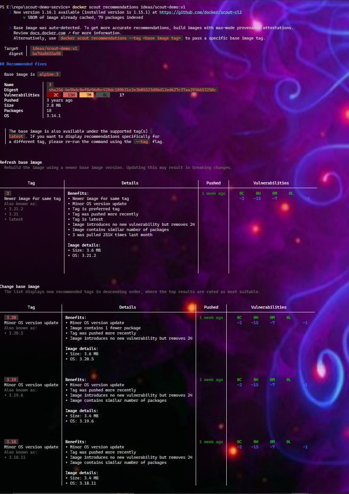
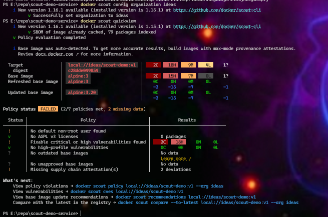

# Docker Scout demo service

A repository containing an application and Dockerfile to demonstrate the use of Docker Scout to analyze and remediate CVEs in a container image.

Read the [Docker Scout Quickstart](https://docs.docker.com/scout/quickstart) for a full walkthrough. You can build and run the image with the following command:

```shell
docker build -t scout-demo:v1 .
docker run scout-demo:v1
```

The application consists of a basic ExpressJS server and uses an intentionally old version of Express and Alpine base image.
 
# VEX demo

This repositoriy contains a VEX document at [.vex/vex-cve-2022-24999.json](.vex/vex-cve-2022-24999.json) suppressing CVE-2022-24999 on `npm/express@4.17.1`.

The VEX document was created with the following command:

```shell
$ vexctl create --author christian.dupuis@docker.com \
    --product pkg:docker/docker/scout-demo-service \
    --subcomponents pkg:npm/express@4.17.1 \
    --status not_affected \
    --vuln CVE-2022-24999 \
    --justification inline_mitigations_already_exist \
    --file .vex/vex-cve-2022-24999.json
```

## Applying the VEX document with Docker Scout

Navigate into the root of the `docker/scout-demo-service` repository and run:

```shell
$ docker scout cves docker/scout-demo-service:main \
    --vex-location .vex
```

The `--vex-location` option passes in paths to VEX documents for the Scout CLI to apply. 

The Scout CLI output will now contain the following addition for the VEX'ed CVE:

```
   0C     1H     0M     0L  express 4.17.1
pkg:npm/express@4.17.1

Dockerfile (14:17)
RUN  apk add --no-cache npm \
 && npm i --no-optional \
 && npm cache clean --force \
 && apk del npm

    ✗ HIGH CVE-2022-24999 [OWASP Top Ten 2017 Category A9 - Using Components with Known Vulnerabilities]
      https://scout.docker.com/v/CVE-2022-24999
      Affected range : <4.17.3
      Fixed version  : 4.17.3
      CVSS Score     : 7.5
      CVSS Vector    : CVSS:3.1/AV:N/AC:L/PR:N/UI:N/S:U/C:N/I:N/A:H
      VEX            : not affected
                     : inline mitigations already exist
                     : christian.dupuis@docker.com
                     : https://openvex.dev/docs/public/vex-5ef17014fb7fede8d223ec5a1b3c0fc575c7fdb25316fd2e32d187d4b68b1243
```

When running the `cves` command with `--vex` all VEX statements that specify a `not_affected` status will be used to filter CVEs. The `--vex-author` options allows to select which VEX statement authors to _trust_.

### Step 1 Setup
1. git clone https://github.com/docker/scout-demo-service.git
2. cd scout-demo-service
3. docker login
4. docker build --push -t ideas/scout-demo:v1 .
### Step 2 Enable Docker Scout
5. docker scout enroll ideas
6. docker scout repo enable --org ideas ideas/scout-demo
### Step 3 Analyze image vulnerabilities
7. docker scout cves --only-package express
7+ Learn more about the docker scout cves command in the CLI reference documentation



### Step 4 Fix application vulnerabilities
8. Update the package.json  [ "express": "4.17.1" to "express": "4.17.3" ]
9. docker build --push -t ideas/scout-demo:v2 .
10. scout cves --only-package express

### Step 5 Evaluate policy compliance
11. docker scout config organization ideas
11+ PS E:\repo\scout-demo-service> docker scout config organization ideas
    i New version 1.16.1 available (installed version is 1.15.1) at https://github.com/docker/scout-cli
          v Successfully set organization to ideas
12. docker scout quickview
    

  
```
  Target               │  local://ideas/scout-demo:v1  │    2C    18H     9M     4L     1?
    digest             │  c28dde049854                 │
  Base image           │  alpine:3                     │    2C    15H     7M     0L     1?
  Refreshed base image │  alpine:3                     │    0C     0H     0M     0L
                       │                               │    -2    -15     -7            -1
  Updated base image   │  alpine:3.20                  │    0C     0H     0M     0L
                       │                               │    -2    -15     -7            -1

Policy status  FAILED  (2/7 policies met, 2 missing data)

  Status │                     Policy                     │           Results
─────────┼────────────────────────────────────────────────┼──────────────────────────────
    !    │ No default non-root user found                 │
    v    │ No AGPL v3 licenses                            │    0 packages
    !    │ Fixable critical or high vulnerabilities found │    2C    18H     0M     0L
    v    │ No high-profile vulnerabilities                │    0C     0H     0M     0L
    ?    │ No outdated base images                        │    No data
         │                                                │    Learn more ↗
    ?    │ No unapproved base images                      │    No data
    !    │ Missing supply chain attestation(s)            │    2 deviations

What's next:
    View policy violations → docker scout policy local://ideas/scout-demo:v1 --org ideas
    View vulnerabilities → docker scout cves local://ideas/scout-demo:v1
    View base image update recommendations → docker scout recommendations local://ideas/scout-demo:v1
    Compare with the latest in the registry → docker scout compare --to-latest local://ideas/scout-demo:v1 --org ideas
```

### Step 6: Improve compliance
Add
    USER appuser 
    to Dockerfile after the EXPOSE 3000
